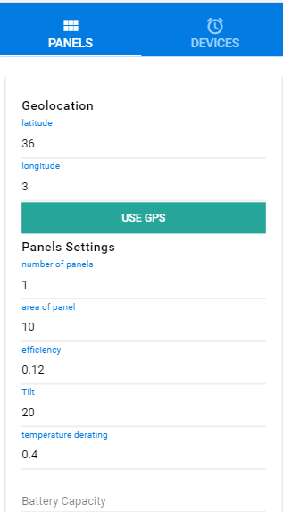
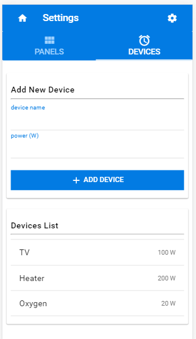
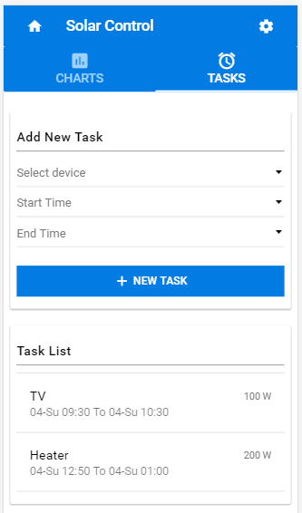
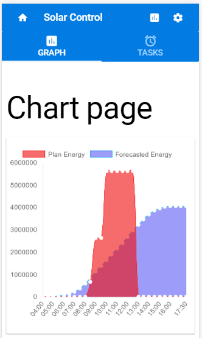
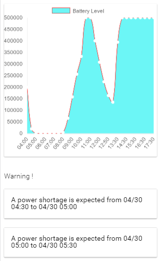

# Solar Control

> A hybird application for solar energy forecasting, usage planning and monitoring
[(competed in nasa app challenge 2017)](https://2017.spaceappschallenge.org/challenges/earth-and-us/you-are-my-sunshine/details)
[by NBT](https://2017.spaceappschallenge.org/challenges/earth-and-us/you-are-my-sunshine/teams/nbt/project)

## Usage

### enter the configuration of the solar panel


### register the devices you have in your house


### create a plan for your energy usage


### vizualise the enregy evolution and check for power shortage warning



## Build Setup

``` bash
# install dependencies
$ npm install

# serve with hot reload at localhost:8080
$ npm run dev

# build for production with minification
# [Note you need quasar for this operation]
$ quasar build
$ quasar wrap quordova
$ cd cordova
$ cordova build
```
